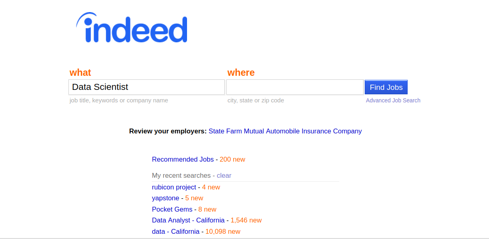
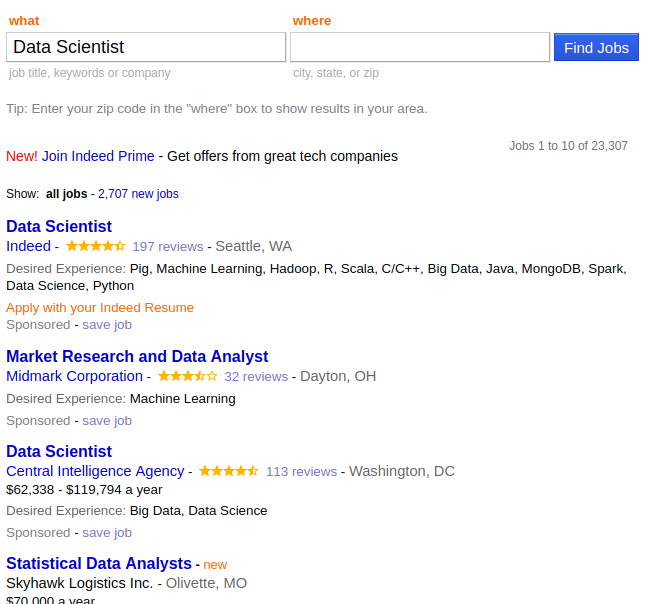
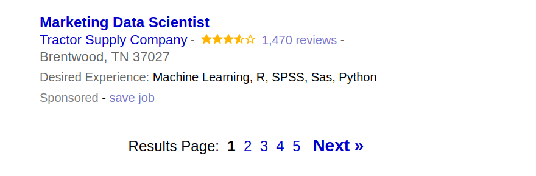
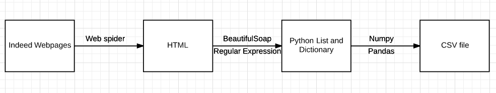
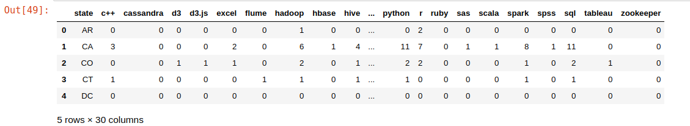

# Job Parser

## Why did I work on this project
When I started to hunt for a data scientist job, I was a little confused about the requirements of the job skills for each data scientist job at different areas. They expected different skills of me. Are there any trend or pattern for skill requirements for each area? I want to know from the exact data.
Then, I started to scrap the information of the data science job skills and correnspnding state from the Indeed website, which is one of the biggest job post website.<br>

## Scrapping phase

### 1. Understand the structure of Indeed
To scrap the information of the Indeed website, first, we have to make sure it is legal to do this. It seems OK to do so!<br>
Then, we have understand the structure of Indeed website.<br>
Indeed: https://www.indeed.com/<br>
The starting page of Indeed is like:



We input the "Data Scientist" in the what frame and click "Find Jobs"<br>
Then we can see the result page like



Each page includes 16 jobs. The top 3 and bottom 3 are sponsered jobs and are not what we are interested in.
We will only scrap the 10 jobs in the middle.Further, we need to move from page 1 to page 2,3... to collect more information



### 2. Developed the pipeline with webspiders
In the web spider, we have achieved:
1. Collect the 10 jobs on each search page
2. Move to folloing pages to collect more 10 job pages
3. Collect the url of the 10 job webpages on each search page
4. Assemble all urls and start to collect job skills and location information on each page

The pipeline is like:



To run the webspider, just invoke the terminal
```shell
cd JobParser
```
Then type the command line

```python
python web_spider.py n
```
n is the number of search pages you want to scrap, for example, if n = 10, you will collect information of
10*10 = 100 jobs. Then, we get the job information data frame and could conduct analysis on it.
Then sample data is like



The generated data is in the data/ directory


## R shiny visualization
After get the data, I also built a small R shiny app. The app is simple but is interesting because I can use it to 
see the skill requirements in each state. I could add more functions to it in the future if I collecte more information
about the job, besides the job requirements.

A simple app has been constructed. Will add more data and make the app better <br>

The app could be run by:
```r
library(shiny)
runGitHub( "JobParser", "hncpr1992") 
```


From the image, we can see that the skill of Python programming is needed most in California, followed by Washington and New York. In the state of California, the most wanted and basic skills for a data scinetist is SQL, Python and R programming.
The graphs is generated based on 500 recently posted data scientist jobs.
